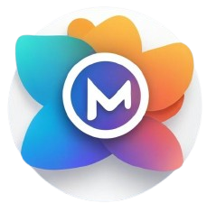
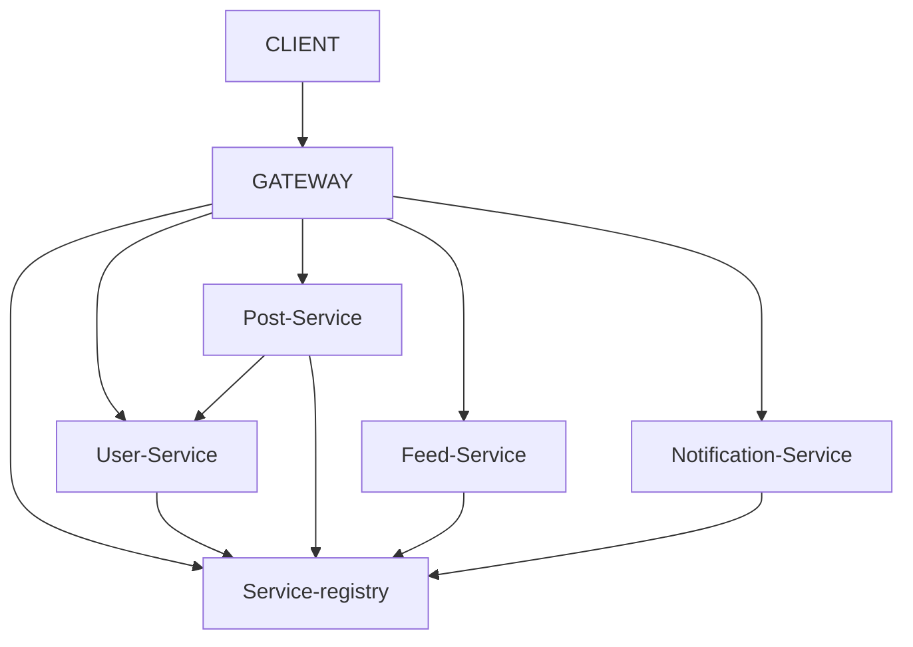

  

# Momento

## Description

Momento is a social media like app, built in java.

## Todos
- Add caching with redis.
- Check locking (Optimistic/Pessimistic).
- Finalize transaction Isolation Levels, and Transaction Propagation.
- FMEA
- Alter services method signatures to return DTOs instead of Domain objects.
- Rethink Dates
- Full maven plugin integration
- project restructure
- enhance UserFollowAvro
- Think more about notifications: Maybe implement them using WebSockets https://claude.ai/chat/da3efdec-365a-4302-b951-e73f95a0c2a2
- Add stress testing with Gatling
- Add a batch process to delete image files, whose metadata are not on posts service DB
- Add Chatting functionality

## Useful Resources
- https://medium.com/ing-tech-romania/implementing-a-basic-kafka-producer-and-consumer-using-spring-boot-spring-kafka-and-avro-schema-2b6d06e6c4cf
- https://stackoverflow.com/questions/61344217/gitlab-ci-pipeline-to-check-for-code-formatting
- https://www.baeldung.com/java-maven-owasp-dependency-check?ref=dailydev
- https://medium.com/@ksaquib/mastering-spring-boot-service-discovery-and-registration-using-spring-cloud-netflix-eureka-a-1eec70317b32
- https://spring.io/guides/gs/centralized-configuration
- https://medium.com/@ankithahjpgowda/api-gateway-in-spring-boot-3ea804003021
- https://dev.to/bansikah/keycloak-and-spring-boot-the-ultimate-guide-to-implementing-single-sign-on-1af7
- https://inero-software.com/keycloak-integration-guide-enabling-social-login-with-multiple-platforms-like-google/#:~:text=Once%20Keycloak%20successfully%20authenticates%20the,user%20back%20to%20the%20client
- https://ui.shadcn.com/
- https://www.baeldung.com/spring-rest-openapi-documentation
- https://medium.com/@AlexanderObregon/sending-push-notifications-using-spring-boot-and-firebase-e1227a7eea99

## Initial Idea

- Microservices:
    - User Service: Manages user profiles and authentication.
    - Post Service: Handles post creation, retrieval, and updates.
    - Feed Service: Aggregates posts from followed users.
    - Notification Service: Sends notifications for new posts, likes, and comments.

- Apache Kafka
    - Post creation events are published to a Kafka topic.
    - Feed service subscribes to this topic to update user feeds.
    - Like and comment events are also published to kafka.
    - Notification service subscribes to like, comment and post topics.

- Nginx
    - Routes requests to the appropriate microservices.
    - Handles static content.

- Rate Limiting
    - Protects API endpoints from excessive requests.

- Hibernate
    - Stores user profiles and post data.

- Redis
    - Caches user feeds for fast retrieval.
    - Stores user session data.
    - Stores active user information.

- Protocol Buffers
    - Used for communication between microservices and for Kafka message serialization.

## Detailed Architecture

- User Service
    - Manages user profiles (username, email, bio, profile picture, followers, following).
    - Handles user authentication and authorization (using JWT or OAuth 2.0).
    - Provides endpoints for user registration, login, profile updates, and follower/following management.
    - Database: Relational database (e.g., PostgreSQL) with Hibernate.

- Post Service
    - Manages post creation, retrieval, updates, and deletion.
    - Handles media uploads (images, videos).
    - Stores post metadata (timestamp, author, caption, media URLs).
    - Database: Relational database (e.g., PostgreSQL) with Hibernate.

- Feed Service
    - Aggregates posts from users a user follows.
    - Implements a real-time feed algorithm (e.g., using Redis sorted sets or a graph database).
    - Provides endpoints for retrieving user feeds.
    - Uses Kafka to subscribe to post creation events.
    - Redis: Used for caching the user feed.

- Notification Service
    - Sends notifications for new posts, likes, and comments.
    - Manages notification preferences.
    - Uses Kafka to subscribe to post creation, like, and comment events.
    - Can integrate with push notification services (e.g., Firebase Cloud Messaging).

- Like/Comment Service:
    - Handles likes and comments on posts.
    - Stores like and comment data.
    - Publishes like and comment events to Kafka.
    - Database: Relational database.

- Media Storage
    - Object storage (e.g., AWS S3, Google Cloud Storage) for storing images and videos.
    - Content Delivery Network (CDN) for efficient media delivery.

- API Gateway (Spring Cloud Gateway or Nginx)
    - Centralized entry point for all API requests.
    - Handles authentication, authorization, rate limiting, and routing.
    - Load balancing across microservice instances.

- Apache Kafka
    - Message broker for asynchronous communication between microservices.
    - Handles post creation, like, and comment events.
    - Ensures reliable and scalable event delivery.

- Redis
    - Caching for user feeds, session data, and active user information.
    - Real-time data storage for feed aggregation.
    - Can be used as a message broker for real time updates.

- Protocol Buffers:
    - Used for efficient data serialization between microservices, and Kafka messages.

### Key Features

- Real-time Feed
    - Users see new posts from followed users in real-time.
    - Feed updates are pushed to clients using WebSockets or Server-Sent Events (SSE).

- Notifications

    - Users receive notifications for new posts, likes, and comments.
    - Customizable notification preferences.
- Media Uploads

    - Users can upload images and videos to their posts.
    - Media files are stored in object storage and served via CDN.

- User Profiles
    - Users can create and manage their profiles.
    - Follow and unfollow other users.

- Search
    - Users can search for other users and posts.
    - Elasticsearch or similar can be used for search functionality.

- Rate Limiting
    - Prevent API abuse with rate limiting.

- Scalability
    - Microservices architecture allows for horizontal scaling.
    - Kafka ensures scalable event processing.

- Security:
    - Secure authentication and authorization.
    - Protect against common web vulnerabilities.

### Technology Stack:

- Spring Boot for microservices development.
- Apache Kafka for message queuing.
- Redis for caching and real-time data storage.
- PostgreSQL for relational databases.
- Object storage (AWS S3, Google Cloud Storage) for media.
- Nginx or Spring Cloud Gateway for API gateway.
- Protocol Buffers for data serialization.
- Websockets or SSE for real time updates.
- Docker and Kubernetes for containerization and orchestration.

### Development Workflow

- Design: Define the microservice architecture and API contracts.
- Development: Implement each microservice independently.
- Testing: Write unit and integration tests.
- Deployment: Containerize microservices and deploy them to a Kubernetes cluster.
- Monitoring: Implement monitoring and logging to track system performance.

## Initial Topology

